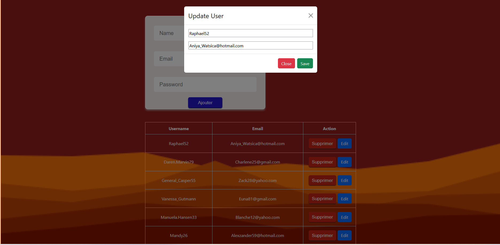
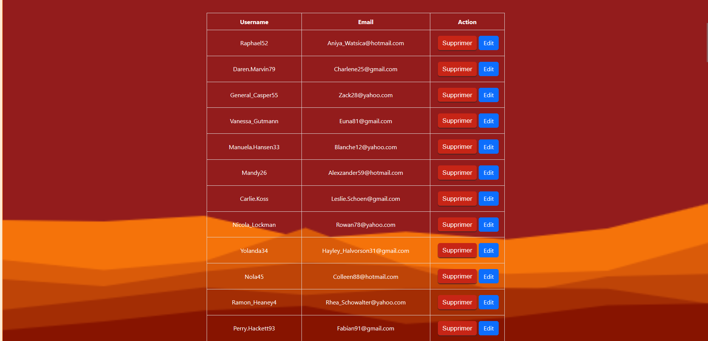

# CRUD-Nodejs-Reactjs

Une application web full-stack de gestion des utilisateurs construite avec **React.js** en frontend et **Node.js/Express** en backend.

## 🎯 Objectif du projet

Cette application permet de gérer une liste d'utilisateurs avec les opérations CRUD complètes :
- **C**reate (Créer) : Ajouter de nouveaux utilisateurs
- **R**ead (Lire) : Afficher la liste des utilisateurs
- **U**pdate (Mettre à jour) : Modifier les informations des utilisateurs
- **D**elete (Supprimer) : Supprimer des utilisateurs

## 📸 Aperçu de l'application

### Dashboard Principal


### Formulaire d'ajout d'utilisateur


### Tableau des utilisateurs


---

## 🏗️ Architecture du système

```
┌─────────────────────────────────────────────────────────────────┐
│                     ARCHITECTURE GLOBALE                         │
└─────────────────────────────────────────────────────────────────┘

┌──────────────────────────────┐         ┌──────────────────────────────┐
│      FRONTEND (React.js)      │         │     BACKEND (Node.js)        │
│   Port: 5173 (Vite Dev)      │         │     Port: 5000               │
├──────────────────────────────┤         ├──────────────────────────────┤
│                              │         │                              │
│  ┌────────────────────────┐  │         │  ┌────────────────────────┐  │
│  │   App.jsx              │  │         │  │   index.js             │  │
│  │ (Composant Principal)  │  │         │  │ (Serveur Express)      │  │
│  └────────────────────────┘  │         │  └────────────────────────┘  │
│           │                  │         │           │                  │
│           ▼                  │         │           ▼                  │
│  ┌────────────────────────┐  │         │  ┌────────────────────────┐  │
│  │  InputArea.jsx         │  │         │  │  Routes API            │  │
│  │ (Formulaire d'ajout)   │  │         │  │ GET /api/users         │  │
│  └────────────────────────┘  │         │  │ POST /api/users        │  │
│           │                  │         │  │ PUT /api/users/:id     │  │
│           ▼                  │         │  │ DELETE /api/users/:id  │  │
│  ┌────────────────────────┐  │         │  └────────────────────────┘  │
│  │  User.jsx              │  │         │           │                  │
│  │ (Tableau utilisateurs) │  │         │           ▼                  │
│  └────────────────────────┘  │         │  ┌────────────────────────┐  │
│           │                  │         │  │  db.js                 │  │
│           ▼                  │         │  │ (Config Base de Données)│  │
│  ┌────────────────────────┐  │         │  └────────────────────────┘  │
│  │  CSS Modules           │  │         │           │                  │
│  │ • index.css            │  │         │           ▼                  │
│  │ • inputArea.css        │  │         │  ┌────────────────────────┐  │
│  │ • user.css             │  │         │  │  Base de Données       │  │
│  └────────────────────────┘  │         │  │ (PostgreSQL)      │  │
│                              │         │  └────────────────────────┘  │
└──────────────────────────────┘         └──────────────────────────────┘
           │                                         │
           │          HTTP / REST API               │
           └─────────────────────────────────────────┘
                    Axios (Client HTTP)
```

## 🔄 Flux de données - Opérations CRUD

```
┌─────────────────────────────────────────────────────────────────┐
│                  FLUX D'UNE OPÉRATION CRUD                      │
└─────────────────────────────────────────────────────────────────┘

1️⃣  CREATE (Créer un utilisateur)
    ┌────────────────┐
    │  Utilisateur   │
    │ remplit le     │
    │ formulaire     │
    └────────┬───────┘
             │ onclick
             ▼
    ┌─────────────────────────────┐
    │ InputArea.jsx               │
    │ - Récupère les données      │
    │ - Valide les champs         │
    └────────┬────────────────────┘
             │ axios.post()
             ▼
    ┌─────────────────────────────┐
    │ POST /api/users             │
    │ Backend Express             │
    └────────┬────────────────────┘
             │ INSERT
             ▼
    ┌─────────────────────────────┐
    │ Base de Données             │
    │ Nouvel utilisateur ajouté    │
    └────────┬────────────────────┘
             │ Réponse
             ▼
    ┌─────────────────────────────┐
    │ App.jsx - État mis à jour   │
    │ state refresh list    │
    └────────┬────────────────────┘
             │ Rendu
             ▼
    ┌─────────────────────────────┐
    │ User.jsx - Tableau updated  │
    │ Nouvel utilisateur visible  │
    └─────────────────────────────┘

2️⃣  READ (Lire/Afficher les utilisateurs)
    ┌────────────────┐
    │  Chargement    │
    │  de la page    │
    └────────┬───────┘
             │ useEffect()
             ▼
    ┌─────────────────────────────┐
    │ GET /api/users              │
    │ axios.get()                 │
    └────────┬────────────────────┘
             │ SELECT *
             ▼
    ┌─────────────────────────────┐
    │ Base de Données             │
    │ Récupère tous les users     │
    └────────┬────────────────────┘
             │ JSON Response
             ▼
    ┌─────────────────────────────┐
    │ App.jsx                     │
    │ setState(users)             │
    └────────┬────────────────────┘
             │ Rendu
             ▼
    ┌─────────────────────────────┐
    │ User.jsx                    │
    │ map() - Affiche chaque user │
    └─────────────────────────────┘

3️⃣  UPDATE (Mettre à jour un utilisateur)
    ┌────────────────┐
    │  Utilisateur   │
    │  clique sur    │
    │  "Modifier"    │
    └────────┬───────┘
             │
             ▼
    ┌─────────────────────────────┐
    │ Form de modification        │
    │ (modal ou inline edit)      │
    └────────┬────────────────────┘
             │ axios.put()
             ▼
    ┌─────────────────────────────┐
    │ PUT /api/users/:id          │
    │ Backend Express             │
    └────────┬────────────────────┘
             │ UPDATE WHERE id=X
             ▼
    ┌─────────────────────────────┐
    │ Base de Données             │
    │ Utilisateur modifié         │
    └────────┬────────────────────┘
             │ Réponse
             ▼
    ┌─────────────────────────────┐
    │ App.jsx - État mis à jour   │
    │ useEffect() refresh list    │
    └────────┬────────────────────┘
             │ Rendu
             ▼
    ┌─────────────────────────────┐
    │ User.jsx - Tableau updated  │
    │ Données modifiées visibles  │
    └─────────────────────────────┘

4️⃣  DELETE (Supprimer un utilisateur)
    ┌────────────────┐
    │  Utilisateur   │
    │  clique sur    │
    │  "Supprimer"   │
    └────────┬───────┘
             │
             ▼
    ┌─────────────────────────────┐
    │ Confirmation                │
    │ (optionnel)                 │
    └────────┬────────────────────┘
             │ axios.delete()
             ▼
    ┌─────────────────────────────┐
    │ DELETE /api/users/:id       │
    │ Backend Express             │
    └────────┬────────────────────┘
             │ DELETE WHERE id=X
             ▼
    ┌─────────────────────────────┐
    │ Base de Données             │
    │ Utilisateur supprimé        │
    └────────┬────────────────────┘
             │ Réponse
             ▼
    ┌─────────────────────────────┐
    │ App.jsx - État mis à jour   │
    │ useEffect() refresh list    │
    └────────┬────────────────────┘
             │ Rendu
             ▼
    ┌─────────────────────────────┐
    │ User.jsx - Tableau updated  │
    │ Utilisateur disparu         │
    └─────────────────────────────┘
```

## 🔌 Endpoints API détaillés

```
┌─────────────────────────────────────────────────────────────────┐
│                    ENDPOINTS DISPONIBLES                        │
└─────────────────────────────────────────────────────────────────┘

┌──────────────────────────────────────────────────────────────────┐
│ GET /api/users                                                   │
├──────────────────────────────────────────────────────────────────┤
│ Description  : Récupère la liste de tous les utilisateurs       │
│ Méthode      : GET                                              │
│ Réponse      : [{ id, nom, email, ...}, ...]                   │
│ Status       : 200 OK                                           │
│ Erreur       : 500 Server Error                                 │
└──────────────────────────────────────────────────────────────────┘

┌──────────────────────────────────────────────────────────────────┐
│ POST /api/users                                                  │
├──────────────────────────────────────────────────────────────────┤
│ Description  : Crée un nouvel utilisateur                       │
│ Méthode      : POST                                             │
│ Payload      : { nom, email, telephone, ... }                  │
│ Réponse      : { id, nom, email, ... }                         │
│ Status       : 201 Created / 400 Bad Request                   │
│ Erreur       : 500 Server Error                                 │
└──────────────────────────────────────────────────────────────────┘

┌──────────────────────────────────────────────────────────────────┐
│ PUT /api/users/:id                                               │
├──────────────────────────────────────────────────────────────────┤
│ Description  : Met à jour un utilisateur                        │
│ Méthode      : PUT                                              │
│ Paramètre    : :id (ID de l'utilisateur)                       │
│ Payload      : { nom, email, telephone, ... }                  │
│ Réponse      : { id, nom, email, ... }                         │
│ Status       : 200 OK / 404 Not Found / 400 Bad Request        │
│ Erreur       : 500 Server Error                                 │
└──────────────────────────────────────────────────────────────────┘

┌──────────────────────────────────────────────────────────────────┐
│ DELETE /api/users/:id                                            │
├──────────────────────────────────────────────────────────────────┤
│ Description  : Supprime un utilisateur                          │
│ Méthode      : DELETE                                           │
│ Paramètre    : :id (ID de l'utilisateur)                       │
│ Réponse      : { message: "Utilisateur supprimé" }             │
│ Status       : 200 OK / 404 Not Found                          │
│ Erreur       : 500 Server Error                                 │
└──────────────────────────────────────────────────────────────────┘
```

## 📊 Structure des données utilisateur

```
┌─────────────────────────────────────────────────────────────────┐
│          MODÈLE DE DONNÉES - UTILISATEUR                        │
└─────────────────────────────────────────────────────────────────┘

{
  "id": 1,                          // Identifiant unique (AUTO)
  "nom": "Jean Dupont",             // Nom complet
  "email": "jean@example.com",      // Adresse email
  "telephone": "+33 6 12 34 56 78", // Numéro de téléphone
  "adresse": "123 Rue de Paris",    // Adresse
  "ville": "Paris",                 // Ville
  "codePostal": "75001",            // Code postal
  "dateCreation": "2024-01-15",     // Date de création (AUTO)
  "dateModification": "2024-02-04"  // Date dernière modif (AUTO)
}
```

---

## 📁 Structure du projet

```
React js/CRUD-Nodejs-Reactjs/
├── Frontend/
│   └── frontend-users/
│       ├── src/
│       │   ├── components/
│       │   │   ├── App.jsx          # Composant principal
│       │   │   ├── InputArea.jsx    # Formulaire d'ajout
│       │   │   └── User.jsx         # Tableau des utilisateurs
│       │   ├── css/
│       │   │   ├── index.css
│       │   │   ├── inputArea.css
│       │   │   └── user.css
│       │   ├── assets/
│       │   ├── main.jsx
│       │   └── images/
│       ├── package.json
│       ├── vite.config.js
│       └── README.md
├── Backend/
│   ├── index.js         # Point d'entrée
│   ├── db.js            # Configuration BD
│   ├── package.json
│   ├── .env
│   └── seedUsers.js     # Script de données initiales
├── images/              # Dossier des screenshots du projet
│   ├── dashboard.png
│   ├── form.png
│   ├── users-table.png
│   └── architecture.png
└── README.md            # Vous êtes ici
```

---

## 🚀 Fonctionnalités principales

### 1. **Affichage des utilisateurs** 📋
- Récupération des utilisateurs via API `GET /api/users`
- Affichage dans un tableau avec bordures stylisées
- Données chargées au démarrage de l'application
- Rafraîchissement automatique après chaque action

### 2. **Ajouter un utilisateur** ➕
- Formulaire intuitif dans le composant `InputArea.jsx`
- Champs validés avant soumission
- Requête `POST /api/users`
- Ajout en temps réel à la liste
- Réinitialisation du formulaire après succès

### 3. **Mettre à jour un utilisateur** ✏️
- Modification des données via `PUT /api/users/{id}`
- Interface inline ou modale
- Mise à jour dynamique de l'interface
- Confirmation des changements

### 4. **Supprimer un utilisateur** 🗑️
- Suppression via `DELETE /api/users/{id}`
- Bouton avec style rouge pour l'identification visuelle
- Confirmation optionnelle avant suppression
- Retrait immédiat de la liste

---

## 🎨 Styles et Design

### Palette de couleurs
- **Bleu principal** : `rgb(37, 22, 199)` - Actions positives
- **Rouge d'alerte** : `rgb(199, 37, 22)` - Suppressions
- **Gris/Blanc** : Contraste et lisibilité

### Caractéristiques UI
- **Responsive Design** : 
  - Formulaire adaptatif (`min-width: 250px`)
  - Tableau avec `width: 100%`
  - Flexbox pour l'alignement

- **Arrière-plan** : Image avec effet parallaxe fixe
- **Typographie** : Police lisible et moderne
- **Animations** : Transitions fluides sur les boutons et survol

---

## 📦 Installation et configuration

### Prérequis
- Node.js (v14+)
- npm ou yarn
- Git

### Backend - Installation

```bash
# Naviguer vers le dossier Backend
cd Backend

# Installer les dépendances
npm install

# Créer un fichier .env avec vos variables
# Exemple:
# PORT=5000
# DB_HOST=localhost
# DB_PORT=5432
# DB_USER=root
# DB_PASSWORD=password
# DB_NAME=crud_app

# Démarrer en développement (nodemon)
npm run dev

# Démarrer en production
npm start
# Le serveur écoute sur http://localhost:5000
```

### Frontend - Installation

```bash
# Naviguer vers le dossier Frontend
cd Frontend/frontend-users

# Installer les dépendances
npm install

# Démarrer le serveur de développement
npm run dev
# L'app est disponible sur http://localhost:5173
```

### Configuration API

Le frontend communique avec le backend via proxy configuré dans `vite.config.js` :

```javascript
// vite.config.js
export default {
  server: {
    proxy: {
      '/api': 'http://localhost:5000'
    }
  }
}
```

---

## 🔧 Technologies utilisées

| Technologie | Version | Utilisation |
|-------------|---------|-------------|
| **React** | 18+ | Framework UI - Frontend |
| **Vite** | 4+ | Build tool & Dev server |
| **Axios** | 1.4+ | Requêtes HTTP Client |
| **Node.js** | 14+ | Runtime Backend |
| **Express** | 4+ | Framework Backend REST |
| **CSS3** | - | Styling et animations |
| **JavaScript ES6+** | - | Langage principal |

---

## 📝 Fichiers clés

| Fichier | Description |
|---------|-------------|
| [`App.jsx`](Frontend/frontend-users/src/components/App.jsx) | Composant principal avec logique CRUD |
| [`InputArea.jsx`](Frontend/frontend-users/src/components/InputArea.jsx) | Formulaire d'ajout d'utilisateurs |
| [`User.jsx`](Frontend/frontend-users/src/components/User.jsx) | Tableau d'affichage des utilisateurs |
| [`index.js`](Backend/index.js) | Serveur Express et routes API |
| [`db.js`](Backend/db.js) | Configuration base de données |
| [`user.css`](Frontend/frontend-users/src/css/user.css) | Styles du tableau |
| [`inputArea.css`](Frontend/frontend-users/src/css/inputArea.css) | Styles du formulaire |

---

## 🎓 Apprentissages clés

Ce projet démontre :

✅ **Communication client-serveur** - REST API avec requêtes HTTP  
✅ **Gestion d'état React** - Hooks (useState, useEffect)  
✅ **Requêtes asynchrones** - Axios avec async/await  
✅ **Opérations CRUD complètes** - Create, Read, Update, Delete  
✅ **Architecture modulaire** - Composants réutilisables  
✅ **Styling CSS** - Responsive design et animations  
✅ **Validation de formulaires** - Vérifications côté client  
✅ **Gestion des erreurs** - Try/catch et feedback utilisateur  

---

## 🚀 Améliorations futures possibles

- [ ] Authentification utilisateur (JWT)
- [ ] Pagination des résultats
- [ ] Recherche et filtrage avancés
- [ ] Tri des colonnes
- [ ] Export PDF/Excel
- [ ] Upload de fichiers
- [ ] Notifications toast
- [ ] Dark mode
- [ ] Tests unitaires (Jest, React Testing Library)
- [ ] Docker pour déploiement

---

## 📸 Galerie de screenshots

### Écran de chargement


### Formulaire en action


### Liste complète d'utilisateurs


---

## 🐛 Troubleshooting

### Backend ne démarre pas
```bash
# Vérifier les logs
npm start

# Vérifier le port 5000 n'est pas utilisé
# Windows: netstat -ano | findstr :5000
# Linux/Mac: lsof -i :5000
```

### Frontend ne se connecte pas au backend
```bash
# Vérifier que le backend est lancé
# Vérifier l'URL proxy dans vite.config.js
# Vérifier CORS dans Express si nécessaire
```

### Erreur de base de données
```bash
# Vérifier les variables d'environnement dans .env
# Vérifier la connexion à la BD
# Exécuter seedUsers.js pour initialiser les données
```

---

## 📞 Support et contact

Pour toute question ou problème :
- Ouvrir une issue sur le repository
- Consulter la documentation Express et React
- Vérifier les logs du serveur et du navigateur

---

## 📄 Licence

Ce projet est sous licence **MIT**. Libre d'utilisation pour usage personnel et commercial.

---

## 🎉 Crédits

**Développé avec** ❤️ en utilisant React, Node.js et Express

**Dernière mise à jour** : 4 février 2026
